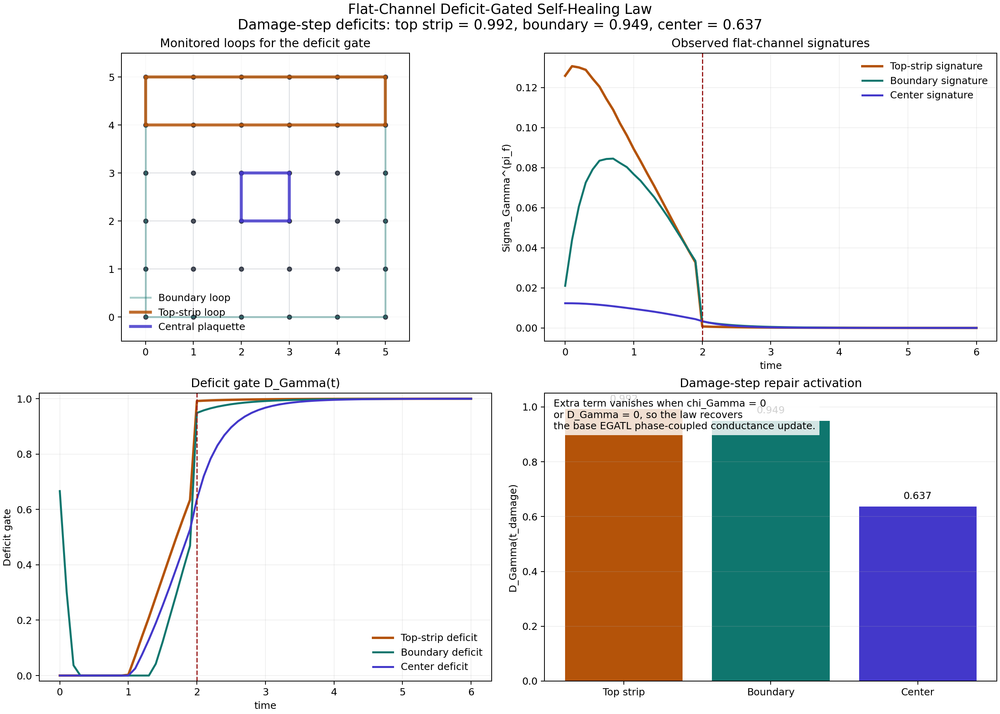
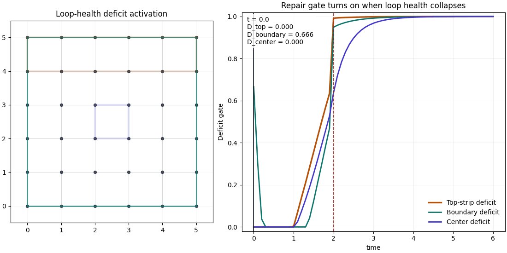

# Flat-Channel Deficit-Gated Self-Healing Law

<!-- HERO_ANIMATION:BEGIN -->


_Hero animation: **Flat-channel deficit-gated self-healing lattice**. [Download high-resolution MP4](images/self_healing_lattice.mp4)._
<!-- HERO_ANIMATION:END -->

TopEquations ID: `eq-flat-channel-deficit-gated-self-healing-law`

Score: 93

This repository contains the publication bundle for the promoted TopEquations entry "Flat-Channel Deficit-Gated Self-Healing Law." The equation extends the EGATL phase-coupled conductance update with a loop-local repair term that turns on when the flat-channel loop signature drops below its healthy reference level.

## Equation

$$
\frac{d g_e}{dt}=\alpha_G(S)\,\|J_e\|\,e^{i\theta_{R,e}}-\mu_G(S)\,g_e-\lambda_s\,g_e\,\sin^2\!\left(\frac{\theta_{R,e}}{2\pi_a}\right)+\chi_\Gamma W_e^{(\Gamma)} D_\Gamma(t)\left(g_{\mathrm{ref}}e^{i\bar{\theta}_\Gamma(t)}-g_e\right)
$$

with

$$
D_\Gamma(t)=\left[1-\frac{\Sigma_\Gamma^{(\pi_f)}(t)}{\Sigma_{\Gamma,\mathrm{ref}}^{(\pi_f)}+\varepsilon}\right]_+,
\qquad
\bar{\theta}_\Gamma(t)=\Theta_\Gamma(t)/|\Gamma|.
$$

## Key Result

Using the published 6x6 recovery run behind the flat-channel loop-signature entry, the deficit gate activates most strongly on the damaged top-strip loop:

- top-strip damage-step deficit: 0.991761
- boundary damage-step deficit: 0.948645
- center-plaquette damage-step deficit: 0.636994
- transfer pre window: 0.813369
- transfer post window: 0.828331

This is the intended behavior: the extra self-healing term is local and loop-aware, not a generic throughput penalty.

## Contents

- `images/flat_channel_deficit_gate_dashboard.png`: static dashboard for the monitored loops, signatures, and deficit gates.
- `images/flat_channel_deficit_gate_activation.gif`: animated loop-activation view over time.
- `data/flat_channel_deficit_gate_metrics.json`: summary metrics used in the submission evidence.
- `data/flat_channel_deficit_gate_timeseries.csv`: time series for signatures and deficit gates.
- `simulations/generate_flat_channel_deficit_gated_artifacts.py`: renderer that rebuilds the dashboard and activation GIF from the committed metrics and timeseries bundle in this repo.

## Reproduction

From this repo root:

```powershell
python simulations/generate_flat_channel_deficit_gated_artifacts.py
```

The script reads `data/flat_channel_deficit_gate_metrics.json` and `data/flat_channel_deficit_gate_timeseries.csv`, then rewrites the preview assets under `images/`.

The provenance for the committed metrics and timeseries remains the canonical TopEquations generator run that consumed the upstream flat-channel loop-signature artifact bundle.

## Preview



